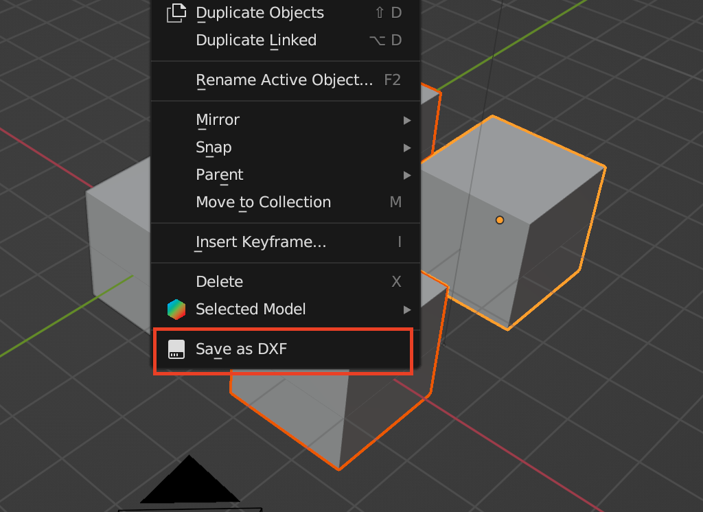
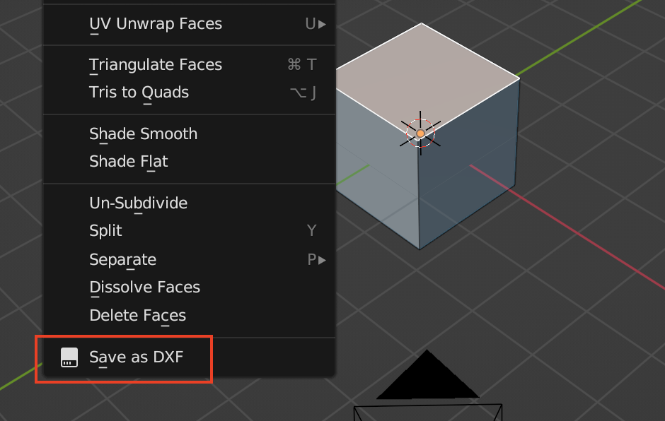

# Blender Save to DXF
A simple add-on for Blender allowing surfaces or selected 2D-objects to be exported as DXF with maintained dimensions. 

It's not meant for a full-blown DXF exporter but as a function similar to Fusion360 to save a surface to a DXF for laser cutting or import to other tools. 

There are some quirks. As it's exporting to regular 2D DXF it will establish the Z coordinate of the first vertex on an object and only export vertices on the same Z level. Selecting the default cube in Blender will therefore render only the surface at the bottom of the cube, according to the global orientation. 

**Heads up:** Transforms will be automatically applied when running the stub. Mostly a convenience as the author of the plugin intermittently forgot to apply before exports. 

# In object mode
Select all objects you want to export, right click and select "Save as DXF". 

# In edit mode
Select the face you want to export, right click and select "Save as DXF"

